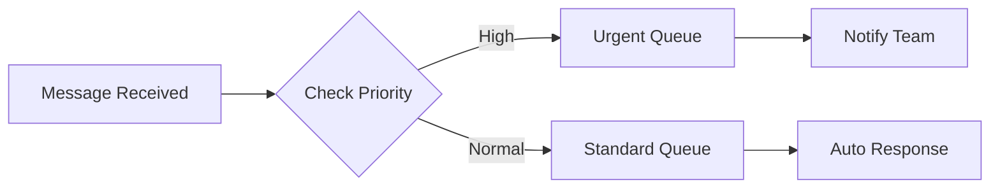

# crate.lol

<p align="center">
  
</p>

Build powerful AI agents through an intuitive drag-and-drop interface. crate.lol makes it easy to create, customize and deploy AI agents without writing code.

## Features

- **Visual Agent Builder**: Drag and drop components to build your agent's logic flow
- **Pre-built Integrations**: Connect popular services and APIs with just a few clicks
- **Custom Actions**: Create reusable action blocks for your specific needs
- **Real-time Testing**: Test your agent's behavior directly in the builder
- **Version Control**: Track changes and roll back when needed
- **Team Collaboration**: Work together on agent development

## Getting Started

1. Sign in at [crate.lol](https://crate.lol)
2. Create a new project
3. Start building your agent using the visual editor

## Building Your First Agent

### 1. Choose Your Building Blocks

The visual editor allows you to drag and drop different types of blocks:

- **Trigger Blocks**: Define when your agent should act
- **Action Blocks**: Specify what your agent should do
- **Logic Blocks**: Control the flow of your agent's decision making
- **Integration Blocks**: Connect with external services


### 2. Configure Your Blocks

Each block can be customized to fit your needs:

```json
{
  "trigger": "message.received",
  "conditions": {
    "channel": "support",
    "priority": "high"
  },
  "actions": [
    "analyze_sentiment",
    "route_to_agent"
  ]
}
```

### 3. Connect Your Blocks

Link blocks together to create complex workflows:



## Advanced Features

### Custom Integrations

Build your own integration blocks using our SDK:

```python
from crate.sdk import Integration

class MyCustomIntegration(Integration):
    def setup(self):
        self.register_action("custom_action", self.handle_action)
        
    async def handle_action(self, context, params):
        # Your custom logic here
        return {"status": "success"}
```

### Webhooks

Configure webhooks to connect external services:

```json
{
  "webhook_url": "https://api.example.com/webhook",
  "events": ["agent.activated", "task.completed"],
  "secret": "your_webhook_secret"
}
```

## Documentation

For detailed documentation, visit our [docs site](https://crate.lol/docs)

- Quick Start Guide
- Block Reference
- API Documentation
- SDK Guide

## Contributing

We welcome contributions! Please see our [Contributing Guide](CONTRIBUTING.md) for details.

```bash
# Clone the repository
git clone https://github.com/crate-lol/crate
cd crate

# Install dependencies
npm install

# Run development server
npm run dev
```

## License

crate.lol is licensed under the [MIT License](LICENSE)

## Support

- Follow us on [Twitter](https://twitter.com/crate_ai)
- Email support: support@crate.lol

---

<p align="center">
Made with ❤️ by the crate.lol team
</p>
